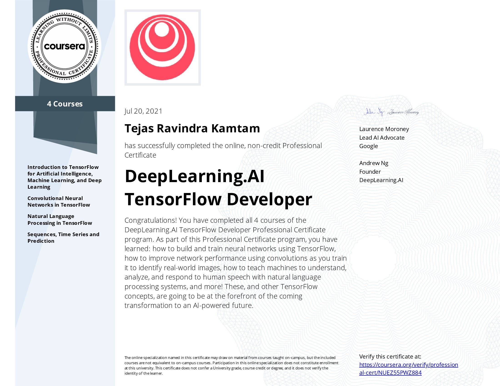

# Tejas Kamtam
<!--

-->

Welcome to my GitHub!

Computer Science student at UCLA working on AI Safety and Quantitative Financial Analysis.

### 🔭 Projects

### 💻 Languages

### 🌱 Courses/Certifications

<!--
**tejaskamtam/tejaskamtam** is a ✨ _special_ ✨ repository because its `README.md` (this file) appears on your GitHub profile.

Here are some ideas to get you started:

- ⏳ I’m currently working on ...
- 🌱 I’m currently learning ...
- 👯 I’m looking to collaborate on ...
- 🤔 I’m looking for help with ...
- 💬 Ask me about ...
- 📫 How to reach me: ...
- 😄 Pronouns: ...
- ⚡ Fun fact: ...
-->
